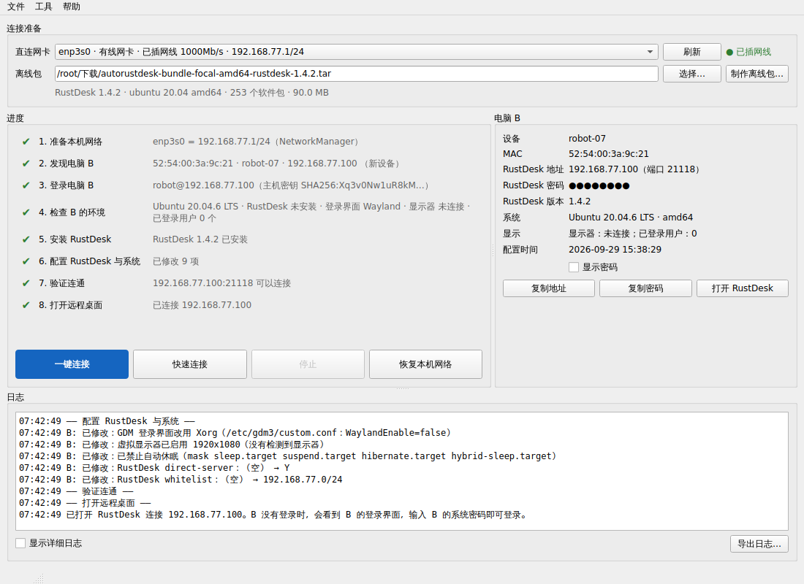

# AutoRustDesk：网线直连一键远控

用一根网线把电脑 A（本机，有屏幕）和电脑 B（Ubuntu 20.04，可以没有显示器）连起来，点一下「一键连接」，程序会自动：

1. **配置直连网络**：给 A 的网卡设直连网段，并临时运行 DHCP 服务。不设网关、不改 DNS，不影响 A 的 Wi-Fi 上网，也不影响 B 原有的网络。
2. **找到 B**：B 用 DHCP 时直接看分配记录；B 是固定 IP 时，通过 IPv6 链路本地地址、被动监听和主动 ARP 扫描找到它。
3. **SSH 登录 B 并检查环境**：包括系统、架构、RustDesk 版本、登录界面、显示器、会话等。
4. **离线安装 RustDesk**：B 没装或版本较旧时，上传离线部署包，用本地软件源安装。B 不需要联网。
5. **配置 RustDesk 和 B 的系统**：开启 IP 直连、设置固定密码、免人工确认、IP 白名单；登录界面改用 Xorg；没接显示器时启用虚拟显示器；禁止自动休眠。
6. **验证并连接**：在 A 上自动打开 RustDesk，以"IP + 密码"连接 B。B 没有登录时看到的是 B 的登录界面，输入 B 的系统密码即可。



> 当前版本的电脑 A 支持 **Ubuntu（及其它使用 NetworkManager 的 Linux 桌面）**，Windows 和 macOS 在规划中（见[路线图](#路线图)）。
> 需求和设计见 [docs/requirements.md](docs/requirements.md)、[docs/design.md](docs/design.md)。

---

## 为什么这样设计

- **用 IP 直连，不用 RustDesk ID**：网线直连时 B 连不上 RustDesk 的公共服务器，按 ID 是连不上的。RustDesk 自带"IP 直连"：B 监听 TCP 21118，A 直接输入 B 的 IP 就能连，不需要任何服务器。
- **离线部署包 = 官方原版 deb + 完整依赖 + 安装配置脚本**，不重新编译 RustDesk。原因有三：
  - 服务自启、登录界面、虚拟显示器等都是 B 的系统配置，本来就打不进程序包；
  - RustDesk 的固定密码以加盐哈希存储，无法预置在文件里；
  - 自己编译要维护 Rust/Flutter 工具链，还要承担 AGPL 义务。
- **没接显示器**：新版 RustDesk 已移除 `allow-linux-headless` 无头模式，本程序自己配置虚拟显示器（`xserver-xorg-video-dummy`）。开机时会自动判断：接了显示器就用真实显示器，没接就用虚拟显示器。

## 环境要求

| | 要求 |
|---|---|
| 电脑 A | Ubuntu 20.04 及以上（x86_64）桌面版；有有线网口或 USB 网卡；已安装 RustDesk 客户端（用于最后一步自动打开连接） |
| 电脑 B | Ubuntu 20.04 桌面版 x86_64；**已开启 SSH**；有一个可以 sudo 的账号 |
| 网线 | 普通网线即可（现代网卡自动识别直连/交叉） |
| 制作离线包 | 任意一台能上网、装了 Python 3.8+ 的电脑（只需做一次） |

## 快速开始

### 第 1 步：制作离线部署包（在能上网的电脑上，做一次即可）

1. 在 [RustDesk Releases](https://github.com/rustdesk/rustdesk/releases) 下载 `rustdesk-<版本>-x86_64.deb`。
2. 用图形界面：菜单「文件 → 制作离线包…」，选择 deb，选一个软件源（国内推荐清华 TUNA），点「开始制作」。
   也可以用命令行：
   ```bash
   python3 -m autorustdesk bundle build ~/下载/rustdesk-1.4.2-x86_64.deb \
       --mirror https://mirrors.tuna.tsinghua.edu.cn/ubuntu
   ```
3. 得到 `autorustdesk-bundle-focal-amd64-rustdesk-<版本>.tar`，大约 90 MB。其中包含 RustDesk、它在 Ubuntu 20.04 上的全部依赖（约 250 个包），以及虚拟显示驱动。每个包都会按软件源索引校验 SHA256；本机有 `gpgv` 和 Ubuntu 密钥环时，还会校验软件源签名。

同一个离线包可以给所有同型号设备使用。

### 第 2 步：在电脑 A 上安装本程序

**方式一：打包版（推荐，免装 Python 依赖）**

```bash
bash packaging/build_linux.sh          # 在一台 Ubuntu 上打包一次（需要联网）
tar xzf dist/AutoRustDesk-*-linux-x86_64.tar.gz
cd AutoRustDesk && ./AutoRustDesk      # 或运行 ./install_desktop_entry.sh 添加到应用菜单
```

打包前，脚本会检查打包机上的系统库。缺什么，它就打印对应的安装命令，例如：

```bash
sudo apt install libxcb-cursor0
```

这些库会一起打进程序包，所以把包拷到其它 Ubuntu 电脑上解压就能直接运行，那台电脑不需要再装。

**方式二：源码运行**

```bash
sudo apt install python3-venv libxcb-cursor0
python3 -m venv .venv
.venv/bin/pip install --upgrade pip    # Ubuntu 20.04 自带的 pip 太旧，装不上新版 PySide6
.venv/bin/pip install -r requirements.txt
.venv/bin/python -m autorustdesk
```

程序以普通用户身份运行。只有配置网卡、运行 DHCP 这类网络操作，会通过系统授权框（pkexec）以 root 权限执行，每次启动输入一次密码。

### 第 3 步：连接电脑 B

1. 用网线连接 A 和 B，确认 B 已开机（网口灯亮）。
2. 在「直连网卡」里选择插了网线的网口（一般会自动选好）。在「离线包」里选择第 1 步得到的 `.tar`；如果 B 已经装好 RustDesk，可以不选。
3. 点「**一键连接**」。
   - 弹出系统授权框时，输入 A 的密码。
   - 弹出登录框时，输入 B 的 SSH 账号和密码。同型号设备通常账号相同，可以勾选「记住密码」。
4. 完成后自动打开 RustDesk 窗口。B 没有登录时，先看到 B 的登录界面，输入 B 的系统密码登录即可。
5. 用完后关闭程序，或点「恢复本机网络」，A 的网卡会恢复原来的设置。

以后再连同一台设备，点「**快速连接**」即可。它会跳过安装和配置，几秒钟就能连上。

连完一台想换下一台：直接拔线换插另一台 B，再点「一键连接」，不用关闭程序。

## 程序对 B 做了哪些修改

所有修改都会记录在 B 的 `/etc/autorustdesk/state.json` 里，修改前的原文件备份为 `*.autorustdesk.bak`。

| 修改 | 目的 | 位置 |
|---|---|---|
| 安装 `rustdesk`、`xserver-xorg-video-dummy` 及缺少的依赖 | 远程控制、虚拟显示器 | apt（使用本地源，`--no-remove`，不会删除任何包） |
| RustDesk 选项：`direct-server=Y`、`direct-access-port=21118`、`verification-method=use-permanent-password`、`approve-mode=password`、`whitelist=<直连网段>` | IP 直连、无人值守、只允许直连网段连接 | `rustdesk --option` |
| RustDesk 固定密码 | 无人值守连接 | `rustdesk --password` |
| `WaylandEnable=false`（并删除被注释掉的那一行） | 让 RustDesk 能控制登录界面。RustDesk 会根据被注释的那一行判断登录界面是 Wayland，所以只改不删还是不行 | `/etc/gdm3/custom.conf` |
| 虚拟显示器配置、开机自动切换服务 | 没接显示器时也有桌面画面；接上显示器后自动改用真实显示器 | `/etc/X11/xorg.conf.d/99-autorustdesk-dummy.conf`、`autorustdesk-display.service` |
| `systemctl mask sleep.target suspend.target …` | 防止 B 在登录界面闲置约 20 分钟后休眠失联（可在设置中关闭） | systemd |
| ufw 放行直连网段访问 21118/tcp（仅在 ufw 已启用时） | 防火墙 | ufw |
| 直连网口临时加一个地址（仅在 B 为固定 IP 时，重启后消失） | 让 RustDesk 走直连网段 | `ip addr` |

撤销系统层面的修改（不卸载 RustDesk）：`sudo python3 /usr/local/lib/autorustdesk/ard_remote.py revert`，然后重启 B。

## 常见问题

**启动时报 `xcb-cursor0 or libxcb-cursor0 is needed`，然后"已放弃 (核心已转储)"**

图形界面库 Qt 从 6.5 版开始，在 X11 桌面下需要系统库 `libxcb-cursor0`，而 Ubuntu 默认没有安装。

- 立即解决：执行 `sudo apt install libxcb-cursor0`。
- 新版本的程序：打包时会把这个库打进包里；源码运行缺库时，会给出上面这条提示，不会再崩溃。

**找不到电脑 B / 发现 B 很慢**
- 确认网线两头的网口指示灯亮，B 已开机。
- B 的 DHCP 可能已经放弃重试。Ubuntu 的 NetworkManager 连续失败几次后，会**停 5 分钟**才再试；只有网线重新接上时才会立刻重试。所以 5 秒内还没收到 B 的地址请求时，程序会让 A 的网口断开再接上一次（"电子拔插网线"），B 一般几秒内就会来要地址。25 秒还不行会再做一次更长的断开。仍然找不到时，可以手动拔插网线试试。
- B 是固定 IP 时，程序会自动扫描常见网段。如果 B 的网口被禁用，需要在 B 上启用。

**发现了 B，但 SSH 连不上**：B 需要安装并启动 `openssh-server`。Ubuntu 桌面版默认没有安装，需要先在 B 上执行一次 `sudo apt install openssh-server`（离线时可用 U 盘拷贝 deb 安装）。

**提示"这个网口好像连着一个局域网"**：链路上发现了别的 DHCP 服务器或多台设备。为避免干扰别人的网络，程序不会启动 DHCP 服务。请确认网线是直接插在 B 上的。

**连上了但黑屏 / 没有画面**
- 在「设置 → 电脑 B」里确认虚拟显示器设置为"自动"或"始终使用"，重新点「一键连接」。
- B 有 `/etc/X11/xorg.conf` 或使用 NVIDIA 专有驱动时，虚拟显示器可能不生效。这时最简单的办法是在 B 上插一个 HDMI 显卡欺骗器（假负载）。

**直连网段与本机网络冲突**：程序会自动改用其它网段，也可以在「设置 → 网络」里指定。

**异常退出后 A 的网卡没有恢复**：重新打开程序后点「恢复本机网络」，或执行 `sudo python3 -m autorustdesk helper --cleanup`。

## 命令行用法

```bash
python3 -m autorustdesk                       # 图形界面
python3 -m autorustdesk bundle build x.deb    # 制作离线包
python3 -m autorustdesk bundle info x.tar     # 查看离线包
python3 -m autorustdesk connect --bundle x.tar --user robot     # 命令行执行完整流程
python3 -m autorustdesk connect --quick       # 已配置过的设备直接连接
```

## 开发与测试

```bash
pip install -r requirements.txt pytest
python3 -m pytest                                  # 单元测试 + GUI 冒烟测试
sudo python3 -m pytest tests/integration           # 用网络命名空间模拟网线直连（需要 root、dhclient）
sudo python3 -m tests.e2e.run_e2e --bundle x.tar   # 端到端：A ⇄ 虚拟网线 ⇄ Ubuntu 20.04 容器（需要 Docker）
```

端到端测试用 `tests/fakes/make_fake_rustdesk.py` 生成的"假 RustDesk"deb 制作离线包。它的依赖列表和安装脚本与官方包一致，程序本体换成了模拟命令行行为的脚本。测试会在不联网的 Ubuntu 20.04 容器里真实地走一遍离线安装。测试覆盖五种场景：B 用 DHCP、B 的 DHCP 已放弃重试（模拟 NetworkManager，只在网线接上时请求地址）、B 是固定 IP 且有流量、B 是固定 IP 且完全不发报文、程序不退出时拔线换插另一台设备；另外还验证快速连接和重复运行的幂等性。

代码结构：

```
autorustdesk/
  bundle/        离线包：格式、制作（纯 Python 解析 Ubuntu 软件源并计算依赖闭包）
  helper/        以 root 运行的网络助手：网卡配置、DHCP 服务、链路监听、ARP 扫描、IPv6 探测
  remote/        在电脑 B 上执行的脚本 ard_remote.py（Python 3.8 标准库）
  core/          流程编排、SSH、设备记录、设置、网卡列表、本机 RustDesk
  gui/           PySide6 图形界面
  cli.py         命令行模式
packaging/       PyInstaller 打包、桌面快捷方式
tests/           单元测试、集成测试、端到端测试
```

## 路线图

- [x] 第一期：电脑 A = Ubuntu
- [ ] 第二期：电脑 A = Windows（netsh 配置网卡、程序以管理员运行、Npcap 可选）
- [ ] 第三期：电脑 A = macOS（networksetup + 授权助手）
- [ ] B 没有 SSH 时的 U 盘引导包
- [ ] 通过自建 RustDesk 服务器跨网络远程

## 说明

RustDesk 是 RustDesk 团队的开源软件（AGPL-3.0）。本工具只分发和调用官方原版安装包，不修改 RustDesk 本身。
